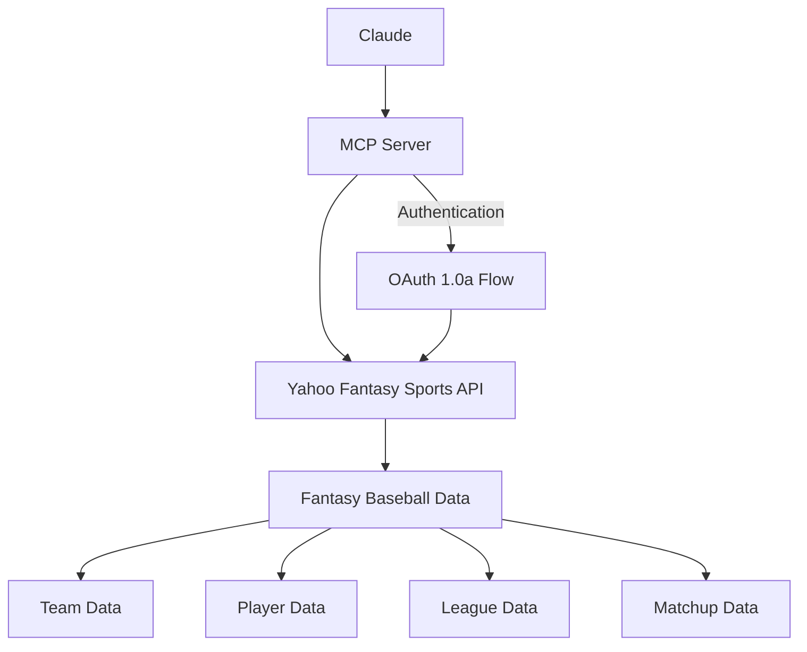

# Yahoo Fantasy Baseball MCP Server Plan

> [!NOTE]
> *This document provides an initial outline plan to develop an MCP server that integrates with Yahoo Fantasy Sports API, specifically for fantasy baseball.*

## Overview

The goal is to create a server that can interact with the Yahoo Fantasy Sports API to provide insights and tools for managing a fantasy baseball team. The server will be built using Python and will utilize the Yahoo Fantasy Sports API for data retrieval.

## Authentication

The Yahoo Fantasy Sports API uses OAuth 2.0 for authentication. You will need to set up your application in the Yahoo Developer Network to obtain your client ID and client secret. This will allow you to authenticate users and access their fantasy sports data.

## Architecture

## Implementation Steps

1. **Set up the MCP server project structure**
   - Create a new TypeScript project in the default MCP servers directory
   - Configure necessary dependencies for Yahoo API integration and OAuth handling

2. **Implement OAuth 1.0a authentication**
    - Create a script to help obtain an initial refresh token
    - Set up token storage and refresh mechanism in the server

3. **Design and implement the following tools:**
   - `get_team_roster`: Retrieve the current team roster with key stats
   - `get_waiver_players`: List available players on the waiver wire with relevant stats
   - `compare_players`: Compare specific players or compare waiver players to your roster
   - `get_matchup`: Get details about your current matchup
   - `get_standings`: Retrieve league standings
   - `search_players`: Search for players based on name or stats criteria

4. **Configure the MCP server in the settings**
    - Add the necessary environment variables for your Yahoo credentials
    - Set the appropriate paths and command to run the server

## Technical Implementation Details

For the Yahoo Fantasy Sports API integration:
- We'll use OAuth 1.0a authentication, which Yahoo requires
- We'll need to handle:
  - Initial authorization (via a separate script)
  - Token storage and refresh
  - API request signing

Each tool will format the response data in a clear, readable manner optimized for conversational interactions with Claude.
